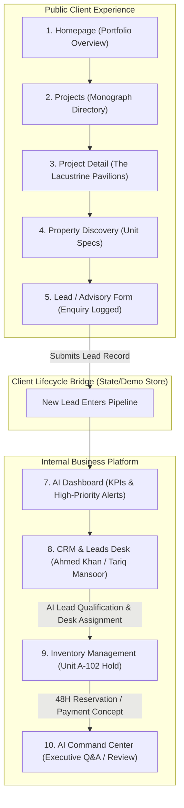
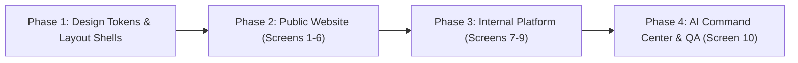

# Hills Pavillion — Frontend Architecture & Implementation Plan (Revised)

> **Project:** Hills Pavillion Frontend Prototype  
> **Source of Truth:** Google Stitch Project `6338356329217012266` (*Hills Pavillion Brand Experience*) & Design System `assets/fb13cc99f83f4c789fb7aa5833b45e94`  
> **Target Stack:** React 19 + TypeScript 5.7 + Tailwind CSS v4 + Vite  
> **Architecture Principle:** Grounded in Stitch designs, deterministic client demo workflow, zero external production dependencies.

---

## 1. Core Principles & Plan Revisions

1. **Stitch is the Visual & UX Source of Truth:**  
   The visual hierarchy, typography, colors, layout, and component aesthetics are taken directly from the Stitch designs. No styling or layouts are redesigned or reinterpreted.
2. **Removal of Invented Business Claims:**  
   Removed decorative enterprise jargon, invented overseas office networks (Zurich, London, Kyoto, Dubai), fictional executive rosters, fake cryptographic ledger claims, and arbitrary agent counts. All placeholder content is grounded in Stitch screen content and explicitly designated as **`[DEMO DATA]`**.
3. **Core Demonstrable Business Workflow:**  
   The prototype is structured around the real client lifecycle:  
   **Public:** `Homepage` → `Projects` → `Project Detail` → `Property Specimen` → `Enquiry / Lead Capture`  
   **Internal:** `New Lead Recorded` → `AI Qualification / Score` → `Sales Assignment` → `Inventory Unit Selection` → `Booking Reserve / Payment Concept`
4. **Mock AI Service (No Direct Gemini API Yet):**  
   AI features use a clean `IAIService` interface with deterministic mock responses for the prototype. Gemini 3 Pro SDK integration is deferred to future phases without requiring UI modifications.
5. **No Premature Backend Infrastructure:**  
   Strictly no REST/GraphQL endpoints, PostgreSQL databases, Salesforce CRM, WhatsApp APIs, production authentication, or accounting systems. The prototype operates as a self-contained, highly dependable client-side application.
6. **Corrected MCP Architecture:**  
   - **Development Phase:** Stitch MCP is used solely for design-to-code inspection and asset synchronization.  
   - **Future Business MCP:** The AI assistant will interface with authorized domain tools (CRM MCP, Inventory MCP, Finance MCP) fronting protected backend services with human approval gates. The AI will never have direct or unrestricted database access.
7. **Deterministic Demo Mode:**  
   Fixed, realistic demo numbers and interactive state transitions allow a flawless presentation story for stakeholder reviews.

---

## 2. Demonstrable Business Workflow & State Architecture



### In-Memory State Synchronization
A shared React state store (`src/data/demoStore.ts`) links user actions across public and private contexts:
- Submitting an inquiry on the Public Advisory/Contact screen immediately prepends a new lead record into the Internal CRM table.
- Clicking *"Inquire on Unit A-102"* on the public project detail pre-selects that specific unit in the Internal Inventory Visual Matrix.
- Selecting *"Reserve Unit"* in the Inventory drawer moves its status badge from `Available` to `Reserved (48H Hold)` and logs the event to the recent activity roster.

---

## 3. Application Structure

All files reside inside this local repository:

```text
hills-pavillion/
│
├── .venv/                         # Local Python virtual environment (uv)
├── pyproject.toml                 # Local Python configuration
├── mcp_config.json                # Local Stitch MCP configuration
├── package.json                   # React 19, TypeScript, Tailwind CSS v4, Lucide
├── tsconfig.json                  # Root TypeScript configuration
├── tsconfig.app.json              # App TypeScript configuration with `@/*` aliases
├── vite.config.ts                 # Vite configuration
├── IMPLEMENTATION_PLAN.md         # This implementation plan
├── README.md                      # Project overview
│
├── public/
│   ├── icons/                     # Architectural SVGs and symbol glyphs
│   └── images/
│       └── stitch/                # Stitch screen assets & architectural photos
│
└── src/
    ├── main.tsx                   # Root entry
    ├── App.tsx                    # Application shell & route controller
    │
    ├── styles/
    │   └── globals.css            # Tailwind v4 tokens (Bodoni Moda & Plus Jakarta Sans)
    │
    ├── lib/
    │   ├── utils.ts               # Class merging (`cn`), currency/metric formatters
    │   └── constants.ts           # Route keys, status mappings
    │
    ├── data/
    │   ├── demoStore.ts           # Central in-memory state connecting public -> CRM -> inventory
    │   ├── projects.ts            # Development portfolio [DEMO DATA]
    │   ├── inventory.ts           # Block A units, floorplates, pricing [DEMO DATA]
    │   ├── leads.ts               # CRM leads, intent scores, interaction logs [DEMO DATA]
    │   ├── construction.ts        # Progress percentages, milestone stages [DEMO DATA]
    │   └── aiCommands.ts          # Deterministic prompt responses [DEMO DATA]
    │
    ├── services/
    │   └── aiService.ts           # Mock AI service interface (Gemini-ready contract)
    │
    ├── hooks/
    │   ├── useNavigation.ts       # Route state, active screen, public/internal toggle
    │   └── useDemoState.ts        # Hook to read and mutate demo workflow state
    │
    ├── layouts/
    │   ├── PublicLayout.tsx       # Minimalist glass header, monograph navigation, footer
    │   └── PlatformLayout.tsx     # High-density operational frame, sidebar, ⌘K search bar
    │
    ├── components/
    │   ├── common/                # ArchitecturalButton, TaxonomyBadge, MetricCounter, Table
    │   ├── public/                # HeroSection, ProjectCard, MilestoneArchive, AdvisoryModal
    │   └── platform/              # InventoryMatrix, UnitDrawer, LeadDetailDrawer, AISuggestionCard
    │
    └── pages/
        ├── public/
        │   ├── HomePage.tsx               # Screen 1: Monograph landing experience
        │   ├── ProjectsPage.tsx           # Screen 2: Development portfolio & master ledger
        │   ├── ProjectDetailPage.tsx       # Screen 3: The Lacustrine Pavilions deep-dive
        │   ├── PropertyDiscoveryPage.tsx  # Screen 4: Public inventory & specimen finder
        │   ├── ConstructionPage.tsx       # Screen 5: Verifiable progress & timeline
        │   └── AdvisoryPage.tsx           # Screen 6: 5-step private client advisory concierge
        │
        └── platform/
            ├── DashboardPage.tsx          # Screen 7: AI Business Operations Dashboard
            ├── CrmLeadsPage.tsx           # Screen 8: CRM & Lead Management (Table + Kanban)
            ├── InventoryPage.tsx          # Screen 9: Visual matrix & unit allocation drawer
            └── CommandCenterPage.tsx      # Screen 10: AI Command Center (Query execution)
```

---

## 4. Routes & Screen Mapping

| Route | Name | Target Stitch Screen | Layout | Primary Business Objective |
|:---|:---|:---|:---|:---|
| `/` | Homepage | `Hills Pavillion — Homepage` (`11a63dc...`) | `PublicLayout` | Brand positioning, flagship project showcase |
| `/projects` | Projects | `Development Portfolio & Projects` (`3bedf7c...`) | `PublicLayout` | Multi-project catalog with typology filters |
| `/projects/:id` | Project Detail | `The Lacustrine Pavilions (Project Detail)` (`15bd228...`) | `PublicLayout` | Architectural floorplans, specs, masterplan |
| `/discovery` | Inventory Discovery | Public inventory & unit specimen explorer | `PublicLayout` | Unit availability & specifications lookup |
| `/construction`| Construction Progress | `Construction Progress & Transparency` (`f137363...`) | `PublicLayout` | Progress tracking, milestone archive, audit stats |
| `/advisory` | Client Advisory | `Private Client Advisory & Acquisition Concierge` (`5c576ad...`) | `PublicLayout` | 5-step structured lead acquisition funnel |
| `/platform` | AI Dashboard | `Internal Business Operations Dashboard` (`74c918b...`) | `PlatformLayout` | Executive KPIs, pending tasks, pipeline metrics |
| `/platform/leads` | CRM & Leads | `CRM & Lead Management Interface` (`da26bbc...`) | `PlatformLayout` | Lead qualification, SLA tracking, sales assignment |
| `/platform/inventory` | Inventory Management | `Inventory Management Interface` (`cacf5e8...`) | `PlatformLayout` | Level-by-level unit matrix, 48h holds, pricing |
| `/platform/command` | AI Command Center | `AI Command Center` (`e02e6f4...`) | `PlatformLayout` | Directive query bar, executive briefing answers |

---

## 5. Design Tokens (From Stitch Master Design System)

Derived 1:1 from Stitch Asset `assets/fb13cc99f83f4c789fb7aa5833b45e94`:

### Colors
- **Canvas Base:** `#FAF9F7` (Honed limestone ground)
- **Muted Container:** `#F3F1ED` (Mid-tone card background)
- **Card Planes:** `#FFFFFF` (Elevated clean surfaces)
- **Carbon Inset:** `#121314` (Deep architectural carbon)
- **Dividers:** `#E5E2DC` (1px hairline rules on light) / `rgba(255, 255, 255, 0.12)` (on dark)
- **Primary Text:** `#121314` (High-contrast carbon)
- **Secondary Text:** `#54524F` (Muted basalt)
- **Bronze Accent:** `#9E876B` (Discreet index labels, active borders)
- **Alert / Overdue:** `#BA1A1A` (SLA breach indicators)

### Typography
- **Display Hero:** Bodoni Moda `84px` (Mobile: `44px`), line-height `92px`, letter-spacing `-0.02em`
- **Headlines:** Bodoni Moda `56px` (`headline-xl`), `40px` (`headline-lg`), `28px` (`headline-md`)
- **Taxonomy & Badges:** Plus Jakarta Sans `11px`, font-weight `600`, letter-spacing `0.2em` uppercase
- **Body:** Plus Jakarta Sans `15px` (`body-default`), `18px` (`body-lead`), `13px` (`body-sm`)

### Structural Geometry
- **Corners:** `0px` radius (`rounded-none`). Clean, sharp right angles matching architectural drawings.
- **Elevation:** Razor-sharp diffused shadow `0 16px 40px -8px rgba(18, 19, 20, 0.06)`, no blur-heavy glows.

---

## 6. Deterministic Demo Dataset & AI Service

### A. Deterministic Presentation KPIs
To deliver a predictable presentation story, the internal dashboard initializes with exact benchmark figures:
- **Pipeline Revenue:** `PKR 84.6M`
- **New Inquiries (This Week):** `42`
- **Active Reservations:** `17 Units`
- **Pending Milestones:** `8`
- **Available Inventory:** `126 Units`

### B. High-Intent Demo Leads
1. **Ahmed Khan** — Budget `PKR 35M`, Target: *The Lacustrine Pavilions (Unit A-102)*, Last Contact: *2 days ago*, Recommended Action: *Call today*.
2. **Dr. Tariq Mansoor** — Budget `PKR 28M`, Site visit requested, Recommended Action: *Confirm visit itinerary*.
3. **Vivienne Dubois** — Budget `USD 450K`, Milestone payment discussion pending, Recommended Action: *Send contract addendum*.

### C. Mock AI Service Architecture (`src/services/aiService.ts`)
```typescript
export interface AIQueryResponse {
  query: string;
  summary: string;
  items?: { title: string; subtitle: string; actionText?: string }[];
  confidence: string;
  timestamp: string;
}

export interface IAIService {
  executeCommand(prompt: string): Promise<AIQueryResponse>;
}

// Current prototype mock implementation
export const MockAIService: IAIService = {
  async executeCommand(prompt: string): Promise<AIQueryResponse> {
    const normalized = prompt.toLowerCase();
    if (normalized.includes('attention') || normalized.includes('leads')) {
      return {
        query: prompt,
        summary: '3 high-priority leads require immediate attention based on 4-hour SLA targets.',
        items: [
          { title: 'Ahmed Khan (PKR 35M)', subtitle: 'Unit A-102 inquiry pending response past 48 hours.', actionText: 'Call Today' },
          { title: 'Dr. Tariq Mansoor (PKR 28M)', subtitle: 'Site inspection requested for North Promontory.', actionText: 'Confirm Visit' },
          { title: 'Vivienne Dubois (USD 450K)', subtitle: 'Payment schedule review requested.', actionText: 'Review Schedule' },
        ],
        confidence: '98.4%',
        timestamp: 'Just now',
      };
    }
    // Default deterministic responses for remaining preset macros...
    return defaultFallbackResponse(prompt);
  }
};
```
*Future Transition:* Replacing `MockAIService` with a Vertex AI / Gemini 3 Pro SDK implementation will only require swapping this single service class, with zero changes to UI components.

---

## 7. Clarified MCP Architecture

```text
┌─────────────────────────────────────────────────────────────┐
│                      DEVELOPMENT PHASE                      │
│                                                             │
│   Developer / Agent  <──────>  Stitch MCP  <──────> Stitch  │
│   (Design inspection, token extraction, asset sync)         │
└─────────────────────────────────────────────────────────────┘

┌─────────────────────────────────────────────────────────────┐
│                FUTURE PRODUCTION BUSINESS PHASE             │
│                                                             │
│                    ┌──────────────────────┐                 │
│                    │     AI Assistant     │                 │
│                    └──────────┬───────────┘                 │
│                               │ MCP Tools                   │
│                               ▼                             │
│          ┌────────────────────┼────────────────────┐        │
│          ▼                    ▼                    ▼        │
│      CRM MCP            Inventory MCP         Finance MCP   │
│   (Leads & Desks)     (Unit Allocations)   (Milestone Escrow│
│          │                    │                    │        │
│          ▼                    ▼                    ▼        │
│    Protected API        Protected API        Protected API  │
│  (Auth Gatekeeper)   (Auth Gatekeeper)    (Auth Gatekeeper) │
│          │                    │                    │        │
│          ▼                    ▼                    ▼        │
│     PostgreSQL           PostgreSQL           Banking API   │
│                                                             │
│  * Security Rule: AI NEVER receives direct database access. │
│  * High-value actions (reservations/escrow) require human   │
│    partner approval.                                        │
└─────────────────────────────────────────────────────────────┘
```

---

## 8. Implementation Phases



### Phase 1: Design Tokens & Layout Shells
- Configure Tailwind CSS v4 in `src/styles/globals.css` with exact Stitch color, font, and 0px radius tokens.
- Build `PublicLayout` (glass header, monograph navigation, global footer, and "Atelier Portal" switcher).
- Build `PlatformLayout` (collapsible dark sidebar, operational header, ⌘K search bar, and partner profile).
- Build atomic reusable components: `ArchitecturalButton`, `TaxonomyBadge`, `MetricCounter`.

### Phase 2: Public Website (Screens 1–6)
- Screen 1: **Homepage** (Monograph hero, featured projects grid, trust metrics).
- Screen 2: **Projects Portfolio** (Multi-project gallery, category tabs, technical master ledger table).
- Screen 3: **Project Detail** (*The Lacustrine Pavilions* monograph, floorplan archetypes, site masterplan).
- Screen 4: **Property Discovery** (Public inventory catalog with typology/price filter).
- Screen 5: **Construction Progress** (7-stage milestone progress bar, site camera frames, audit metrics).
- Screen 6: **Private Client Advisory** (5-step interactive concierge connecting directly to demo CRM).

### Phase 3: Internal Business Platform (Screens 7–9)
- Screen 7: **AI Dashboard** (Executive KPIs: Revenue `PKR 84.6M`, leads pipeline, operations roster).
- Screen 8: **CRM & Lead Management** (Table view, Kanban view, lead qualification score, slide-over dossier).
- Screen 9: **Inventory Management** (Level-by-level Block A visual matrix, status toggles, 48h partner hold drawer).

### Phase 4: AI Command Center & Verification (Screen 10)
- Screen 10: **AI Command Center** (Directive query bar, deterministic prompt answers, audit telemetry log).
- Wire end-to-end demo lifecycle: Public Enquiry → CRM Lead → Unit Hold → AI Insight.
- Responsive testing (Desktop 1200px+, Tablet 768–1199px, Mobile <768px).
- Clean production build verification (`npm run build`).

---

## 9. Next Steps

Execution will pause here for review. Upon your confirmation, Phase 1 implementation will begin.
